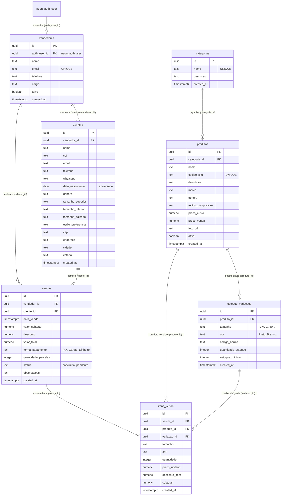
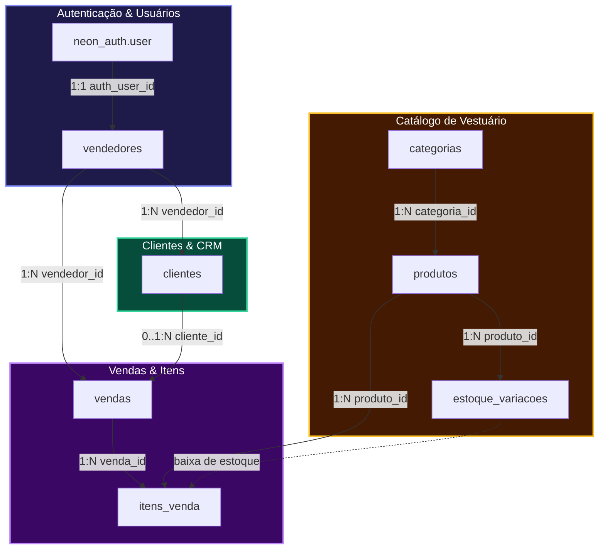

# Arquitetura e Modelo de Entidade-Relacionamento (ER) — Loja de Roupas

Este documento descreve a modelagem arquitetural e os relacionamentos do banco de dados PostgreSQL hospedado no Neon (`vagner_roupas`).

---

## 1. Diagrama Visual de Relacionamento de Entidades (ERD)

---

## 2. Mapa dos Módulos do Sistema

### 🛍️ Módulo Catálogo & Estoque
* **`categorias`**: Separação das peças por departamento (ex: *Camisetas, Calças Jeans, Vestidos, Acessórios*).
* **`produtos`**: Informações mestres da peça de vestuário (nome, SKU, marca, tecido, preço sugerido).
* **`estoque_variacoes`**: Grade real de moda. Uma camisa pode ter variações de tamanho (*P, M, G*) e cores (*Azul, Branco*), cada qual com sua quantidade independente em estoque e alerta de estoque mínimo.

### 👥 Módulo Comercial & CRM de Clientes
* **`vendedores`**: Operadores da loja vinculados à autenticação do Neon Auth (`neon_auth.user`).
* **`clientes`**: Perfil 360º do cliente com informações de contato, endereço e **preferências de medidas** (tamanhos de roupas e calçados, data de aniversário para ações de marketing via WhatsApp).

### 💳 Módulo de Vendas & Caixa
* **`vendas`**: Cabeçalho do pedido com identificação do vendedor, cliente (ou venda de balcão anônima), forma de pagamento (*PIX, Cartão, Dinheiro*), descontos e valor final.
* **`itens_venda`**: Linhas do pedido detalhando exatamente qual produto, tamanho e cor saíram, valor unitário e total.

---

## 3. Fluxo de Operações e Chaves Estrangeiras

---

## 4. Políticas de Integridade e Exclusão (Foreign Keys)
* `ON DELETE CASCADE` em `estoque_variacoes` (ao remover um produto, suas grades são removidas).
* `ON DELETE CASCADE` em `itens_venda` (ao remover uma venda, seus itens são removidos).
* `ON DELETE SET NULL` em `produtos.categoria_id` (se a categoria for apagada, o produto não é perdido).
* `ON DELETE SET NULL` em `vendas.cliente_id` (permite manter o histórico financeiro da venda mesmo se um cliente for removido).
